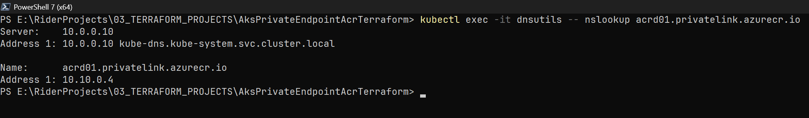
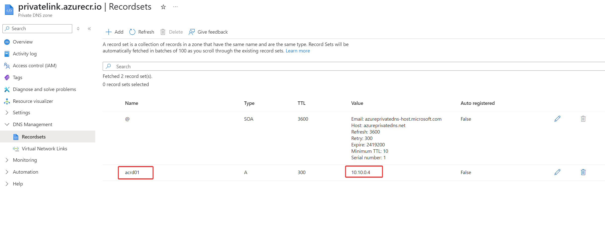

# AKS with Private endpoints ACR integration using Terraform

This project provisions a secure Azure Kubernetes Service (AKS) cluster integrated with a private Azure Container
Registry (ACR) using private endpoints and DNS zone configuration. All components are deployed with restricted network
access for enhanced security.

## DNS Resolve output

## Features

- Creates a Virtual Network (VNet) with dedicated subnets
- Deploys an Azure Container Registry (ACR) with public network access disabled
- Configures a Private Endpoint for the ACR in the AKS subnet
- Sets up a Private DNS Zone (`privatelink.azurecr.io`) and links it to the VNet
- Adds DNS record pointing to the ACR Private Endpoint IP
- Deploys AKS cluster with nodes in the private subnet
- Integrates AKS with ACR using RBAC role assignments

### For AKS to pull images from ACR:

The AKS kubelet identity must have the following role assignment:

- **AcrPull** role on the ACR

This role assignment is automatically created by this Terraform.

## Deployment Notes

- ACR is provisioned with `network_rule_set` default action set to `Deny` and no bypass rules.
- A private endpoint is created inside the AKS subnet and a corresponding DNS record is registered in the private DNS
  zone.
- Public network access to ACR is disabled.
- Only resources within the same VNet (AKS subnet) can access the ACR.
- AKS uses a system-assigned managed identity or a user-assigned identity, which is granted `AcrPull` access.

### Deployment order

- Provision VNET and AKS nodes subnet
- Provision ACR with private access only
- Private endpoint in AKS subnet
- Private DNS zone creation and link to VNET
- DNS record for ACR Private Endpoint
- AKS cluster deployment with node pool in subnet
- ACR pull access role assignment for AKS identity

## Modules

- https://registry.terraform.io/providers/hashicorp/azurerm/latest/docs/resources/container_registry
- https://registry.terraform.io/providers/hashicorp/azurerm/latest/docs/resources/subnet_network_security_group_association
- https://registry.terraform.io/providers/hashicorp/azurerm/latest/docs/data-sources/kubernetes_cluster
